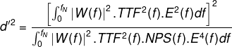

This repository contains my ImageJ plugins to help with some medical physics
tasks. The skeleton I have used was taken from https://github.com/imagingbook/imagej1-plugins-ide-setup.
I have stripped out the netbeans and Eclipse folders.

# Requirements
You will need ImageJ installed on your computer. These plugins are tested with
the version of ImageJ available here: https://imagej.net/ij/download.html. I
have not tested these plugins with FIJI.

The plugins depend on the Apache commons maths library version 3.6.1. A copy of
this library is included in the repository. If you would rather download it
from Apache then you can extract it from the commons-math3-3.6.1-bin.zip file
that can be downloaded from: https://archive.apache.org/dist/commons/math/binaries/

# Installation
1. Download or clone this repository to your computer
2. Go to the `project-intellij/jars` folder of the downloaded or cloned files
3. The folder contains files called `QuantitativeIQ.jar` and `commons-math3-3.6.1.jar` 
4. Run ImageJ
5. Drag the `commons-math3-3.6.1.jar` file onto the ImageJ window
6. Drag the `QuantitativeIQ.jar` file onto the ImageJ window. Click `Save` to 
accept the file location if asked.

# Troubleshooting
You may receive a message stating `Unrecognized command: "Fit Polynomial"` when
trying to run the `Noise Power Spectrum (CT)` command. If you see this it means
that your ImageJ installation is missing the `Fit Polynomial` command from the
`Filters` menu. To fix this:

1. Go to https://imagej.net/ij/download.html
2. Download the `ZIP archive` from the `Platform Independent` section of the page
3. Extract the zip file onto a folder on your computer
4. Navigate to the `ImageJ/plugins/` folder in the extracted files
5. Copy the contents of this folder into the `plugins` subfolder of your ImageJ
installation location.

# The plugins

## TextureMap
Diagnostic Radiology. Calculate a variance or signal-to-noise map of a
digital x-ray image.

The routine will run on a user-selected rectangular region of
interest (ROI). If no ROI is selected then the whole image is
selected and analysed.

It breaks the large ROI into smaller square ROIs, and calculates
the chosen statistical parameter for each region. The user is
asked to supply the side-length of the smaller ROIs (in mm).

The routine calculates variance as:

sum[x - mean(x)] / n

The routine calculates standard deviation as:

sqrt(variance)

The routine calculates signal-to-noise as:

mean(x) / standard deviation(x)

## ResampleImage
Nuclear Medicine. This re-samples an existing image to simulate a new image that would
have been acquired using a lower number of counts.

## TaskTransferFunction
Diagnostic Radiology. This calculates the task transfer function of a circular
object within an image.

## NoisePowerSpectrum
Diagnostic Radiology. This calculates the noise power spectrum from a series of regions
of interest in a uniform image.

## EyeModel
ImageJ plugin to calculate eye frequency response using either
Richard and Siewerdsen 2008, http://dx.doi.org/10.1118/1.2988161:

E(f) = f^n.exp(-c.f^2)

where:

*  f = radial spatial frequency (mm-1)
*  n = 1.3
*  c = 3.093 for a 50 cm viewing distance for E(f) to peak at 4 degree-1

or Solomon et al 2015, http://dx.doi.org/10.1118/1.4923172:

E(p) = |n.p^a1.exp(-a2.p^a3)|^2

where:

*  a1 = 1.5
*  a2 = 0.98
*  a3 = 0.68
*  n is a normalisation constant to make max E(p) = 1.0
*  p is angular spatial frequency (degree^-1)

p can be calculated from radial spatial frequency using:

p = (f.FOV.R.pi) / (D.180)

where:

*  f is radial spatial frequency (mm^-1)
*  FOV is the reconstructed field of view of the image (mm)
*  R is the viewing distance (mm)
*  D is the display size (mm) (assumed to be 305 mm in the Solomon paper)

The Solomon et al 2015 section above is mathematically the same as that used by
the imquest software Eckstein option except that  the original Eckstein work did not
normalise the function, nor did it square the result (http://dx.doi.org/10.1364/OE.11.000460).

## TaskFunction
This calculates the radial frequency response of a disc-shaped object of a user-specified
diameter and contrast.

## DetectabilityIndex
Uses the TaskTransferFunction, NoisePowerSpectrum, EyeModel and TaskFunction
to calculate a numerical index that relates to the detectability of an object.
The detectability index (d') is calculated according to equation 2 in
http://dx.doi.org/10.1118/1.4923172 adapted for radial frequency rather than u, v.
Note that in this plugin the integration limits for calculating d' are 0 to the
Nyquist frequency. The equation used by the plugin is shown below:

where:

*  f is radial frequency
*  W(f) is a task function, the Fourier transform of the signal to be detected
*  TTF(f) is the task transfer function
*  NPS(f) is the noise power spectrum
*  E(f) is the frequency response of a model of the human eye
*  fN is the Nyquist frequency calculated from the image pixel size

# Using this repository

## Setup for writing ImageJ Plugins with IntelliJ
This repo contains a minimal setup for writing ImageJ (1) plugins with [IntelliJ](https://www.jetbrains.com/idea/).
The project is set up with ``<project-root>/plugins/`` as the default output folder (for generated ``.class`` files).

This repository is based on the [**imagingbook**](http://imagingbook.com) support suite.
See [www.imagingbook.com](http://imagingbook.com) for additional resources.

### Setup
Clone this repository. It contains a folder for ``project-intellij/``, a self-contained project for IntelliJ.

#### IntelliJ:
Start the **IntelliJ IDEA** and use ``Open`` in the *Welcome screen* to navigate to the ``project-intellij/`` folder.
Editing and saving plugin source files should update the associated class files (in ``plugins/``) automatically.

### Starting ImageJ
The ImageJ runtime can be launched in various ways:
- **Windows**: Execute ``ImageJ.exe`` (by double-clicking on the file).
When ImageJ starts up, it may ask for the ``javaw.exe`` executable, typically located in ``C:\Program Files\java\jre1.8xxx\bin\``. In case of problems, simply delete the ``ImageJ.cfg`` file and start anew.
- **MacOS**: Launch ``ij.jar``.
- **Java**: Run the ``ij.ImageJ.main()`` method within Eclipse.

The entire ImageJ functionality is contained in the single archive ``ij.jar``. To **update** to the most recent version, simply select ``Help`` -> ``Update ImageJ...`` from the ImageJ main menu.

### Adding/editing your plugin code
Code for ImageJ plugins is contained in the ``<project-root>/src-plugins/`` directory. Plugins may be contained in Java packages (such as ``my_plugins`` in this example). **Note** that packages with plugins may only be **one level deep**, otherwise ImageJ will not find them! It is recommended to use at least one underscore (``_``) in a plugin name to make ImageJ automatically install the plugin into the ``Plugins`` menu at startup.

### Executing plugins
At startup, ImageJ automatically installs existing plugins (under the above conditions) into the ``Plugins`` menu. To execute, simply select the listed plugin from the menu.

When the plugin's source code is **edited** in the IDE, the associated ``.class`` file in ``plugins/`` is updated (by Eclipse/IntelliJ), but **not** automatically reloaded by the ImageJ runtime. To **exectute an edited plugin** in ImageJ, use ``Plugins`` -> ``Compile and Run...`` and select the associated ``.class`` file (no compiler is needed).

### Adding other libraries (jars)
This project uses **no dependency management** (such as *Maven*) to keep things simple. If any external libraries are required, just do the following:
- Copy the associated JAR file ``xxx.jar`` into ``jars/``.
- In your IDE, add the JAR file to Java build path.
- Restart ImageJ.

### Additional ImageJ resources

- [ImageJ Home](https://imagej.nih.gov/ij/index.html)
- [ImageJ Plugins](http://rsbweb.nih.gov/ij/plugins/index.html)
- [ImageJ API (JavaDoc)](http://rsbweb.nih.gov/ij/developer/api/index.html)
- [ImagingBook (book and source code)](http://imagingbook.com)
